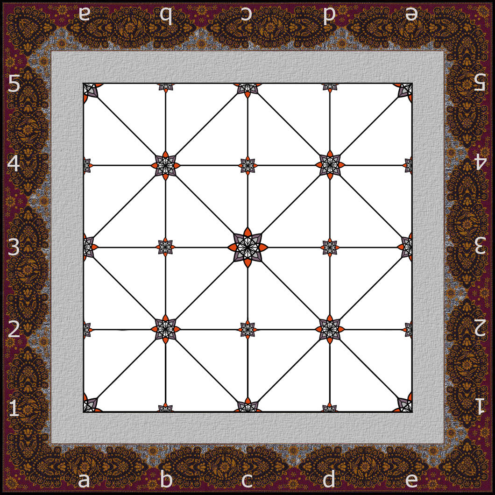
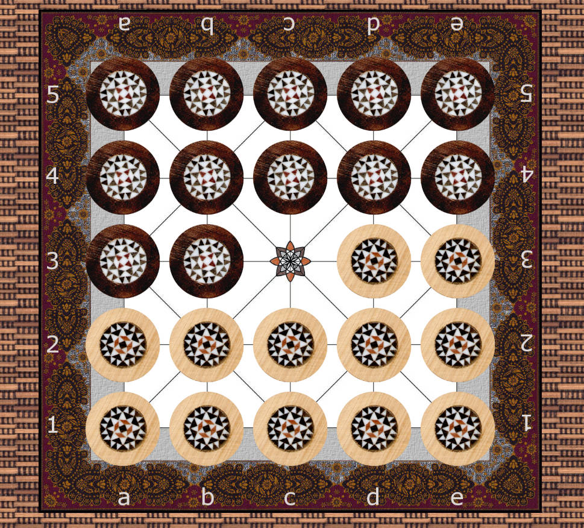

 Alquerque
====================

Alquerque - 2 player abstract strategic perfect information
traditional board game with computer AI option.

## Abstract

_Alquerque - a board game demonstrator with computer AI using
Monte-Carlo Tree Search (MCTS) with UCB (Upper Confidence Bounds)
applied to trees (UCT in short). Alquerque is a medieval Spanish
board game closely influenced and originated from the Middle East
also known there as the game called Quirkat, Qirkat, or El-Quirkat.
Etymological studies by Arie van der Stoep seem to strengthen the
thesis for evidence of Roman influences. Assumption is that the
Arabic qirq or qirqa is borrowed from the Latin word calculus (meaning
a pebble or stone piece). If your sources distinguish among various
Alquerque game variants then the most likely name for the implemented
game found here might be "Alquerque de doze". The oldest written
description might be by Abu al-Faraj al-Isfahani in his works of
Book of Songs ("Kitab al-Aghani"). Although the rules were not
described in there. An medieval source mentioning rules is the
Libro de los juegos affiliated to (or at least commissioned by)
Alfonso X el Sabio of León and Castile. Robert Charles Bell came up
with modern rule proposals and enhancements later on.
This Alquerque implementation has minor rule refinements neither
covered by Alfonso X nor Robert Charles Bell. Still the final
rule set is close to the suggestions made by R.C. Bell._

__Keywords, Categories__ _Monte-Carlo Tree Search (MCTS),
Upper Confidence Bounds (UCB), UCB applied to trees (UCT), AI,
2-player board game, deterministic game with perfect information,
JavaScript, ECMAScript, W3C WebWorker_ 

#Description

This Alquerque is a board game using Monte-Carlo Tree Search (MCTS) with
UCB (Upper Confidence Bounds) applied to trees (UCT in short) for the
computer player AI. The board game is used for demonstration purposes of
the UCT algorithm.

#Rules

There are different rules available for Alquerque de doze.
The default rules as implemented here are as follows.
Mind that some parts of the rules might be altered through
selected options.

##Game Material

Alquerque is a board game. The rectangular Alquerque board has
fixed dimension of 5 times 5 positions horizontally and vertically.
Positions on board are connected by a fixed line pattern showing
potential paths of movement for players’ checkers. The checkers
are placed on the positions (or _points_) of line intersections
in the line pattern. There are two opposing players: one is
controlling the light checkers and the other is controlling
the dark checkers.

##Starting Position

The twelve light checkers are placed on all positions of rows 1 and 2,
and positions d3 and e3 initially. Thus the row 1 is referred to as
being the base row of the player controlling the light checkers.
The twelve dark checkers are placed on all positions of rows 4 and 5,
and positions a3 and b3 initially. Thus the row 5 is referred to as
being the base row of the player controlling the dark checkers.

##Game Mechanics

Alquerque is played alternating players’ turns. The player
controlling light checkers moves first. A player might either

* capture opponent’s pieces if possible or
* must perform a normal non-capturing move.

Passing is not allowed.

##Non-capturing Move
 
Movement of checkers is performed strictly along the lines of
the board onto adjacent free positions.

A light checker can not move from it's position to positions
on rows with lower numbers. A dark checker can not move from
it's position to positions on rows with higher numbers.
Thus neither a light nor a dark checker can move backwards
in direction of the player's own base row.

A checker that reached the opponent's base row can not be
moved any longer but only capture opponent's checkers
if possible. Anyway the checker is allowed to perform
non-capturing moves again, too, if after the capture it is
not positioned on the opponent's base row any longer.

##Capturing Move

Captures are compulsory. If capturing is possible on a
player’s turn then the player must perform a capturing move.
A capture can be performed in any straight direction
indicated by the line pattern of the board (even in
direction of own base row).

An opponent's checker on an adjacent position along a
line of an own checker is captured by jumping over it
in straight line onto an adjacent free position along
the line. Jumping to perform captures is done in straight
line without any change of direction. Checkers captured
leave the board and do not return. By each jump exactly
one single opponent's checker is jumped over and thus
captured at a time. Checkers can not jump over or capture
checkers of own color. Captures can be done and are mandatory
if available any time on own turn after the game has started.

In a player's turn multiple consecutive captures performed
with the same own checker are allowed and compulsory.
The player must continue to capture in the possible multiple
consecutive capture until no additional capture is possible.
It is not necessary to select the longest possible path
to capture the maximum opponent’s pieces. On alternative paths
the player may decide freely on which one to continue capturing.
After each single straight line jump if performing multiple
consecutive captures the direction of jumps may be changed
although reverse direction change is not allowed.
A captured checker is removed from game play instantly while
being jumped. Thus it can not be reused to be jumped again
in a multiple capture move.

Checkers can not be stacked by moving or jumping
on top of the other.

##Winning Conditions

A player wins by either capturing all opponent's checkers or
if the opponent can not perform any legal move.
With given rules a tie or draw game is only possible
if the option _Inverting each pieces' own last move
is... allowed_ is chosen. Per default inverting each pieces'
own last move is strictly forbidden.

#References

* Guillaume Maurice Jean-Bernard Chaslot, "[Monte-Carlo Tree Search](https://project.dke.maastrichtuniversity.nl/games/files/phd/Chaslot_thesis.pdf)", PHD Proefschrift, Universiteit Maastricht, NL, 2010.
* Guillaume Chaslot, Sander Bakkes, Istvan Szita and Pieter Spronck, "[Monte-Carlo Tree Search: A New Framework for Game AI](http://sander.landofsand.com/publications/AIIDE08_Chaslot.pdf)", in Proceedings of the Fourth Artificial Intelligence and Interactive Digital Entertainment Conference, Stanford, California, 2008. Published by The AAAI Press, Menlo Park, California.
* Alfonso X el Sabio, "Libro de los Juegos" or "Libros del Axedrez, Dados et Tablas", 98 double-sided pages, available at the monastery library Real Sitio de San Lorenzo del Escorial, Madrid, Spain, written from 1251 to 1282.
  * [Transcript/Translation into English](http://www.mediafire.com/?nenjj1dimtd) by Sonja Musser Golladay
* Robert Charles Bell, "Board and Table Games from Many Civilizations", Volume 1, Dover Publications, US, 1979.
* Sonja Musser Golladay, "[Los libros de acedrex dados e tablas: Historical, Artistic and Metaphysical Dimensions of Alfonso X's Book of Games](http://arizona.openrepository.com/arizona/handle/10150/194159)", PhD Dissertation, 591pp., The University of Arizona, US, 2007.
  * http://hdl.handle.net/10150/194159
  * http://jnsilva.ludicum.org/HJT2k9/AlfonsoX.pdf
* Arie van der Stoep, "[The origin of morris and draughts by etymology](http://bgsj.ludus-opuscula.org/PDF_Files/9_15_Stoep_print.pdf)", in Board Game Studies Journal, Issue 9, 2015, ISSN 2183-3311, http://bgsj.ludus-opuscula.org, published by Associação Ludus, Lisboa, Portugal, 2015.

# 3rd Party Libraries

* jQuery: MIT licensed, https://github.com/jquery/jquery
* jQuery Mobile: MIT licensed, https://github.com/jquery/jquery-mobile
* Raphaël: MIT licensed, https://github.com/DmitryBaranovskiy/raphael

#Links

* Association for the Advancement of Artificial Intelligence, http://www.aaai.org
* HTML Living Standard, Web Workers, https://html.spec.whatwg.org
* Standard ECMA-262 ECMAScript Language Specification, http://www.ecma-international.org/publications/standards/Ecma-262.htm
* Alphonso X - Book of Games - A Game Researcher's Resource, http://historicgames.com/alphonso
* Board Game Studies Journal, http://bgsj.ludus-opuscula.org

#Contributors / Authors

<table>
  <tr>
    <td>
Oliver Merkel
    

    </td>
  </tr>
</table>

_All logos, brands and trademarks mentioned belong to their respective owners._
