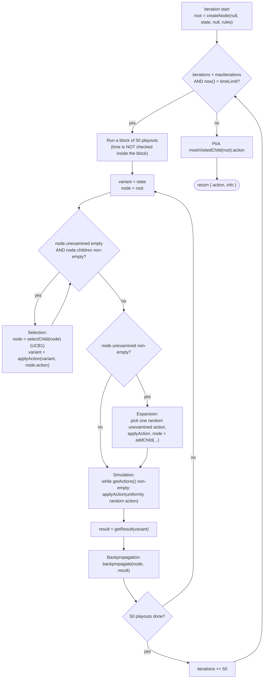
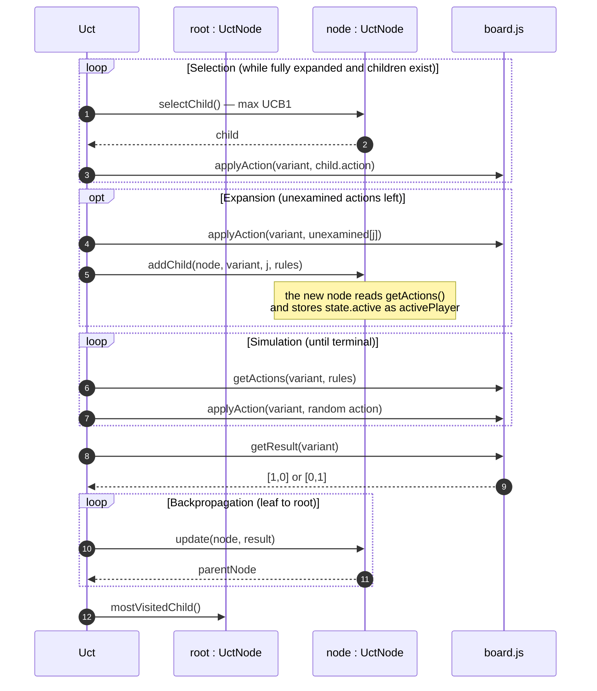
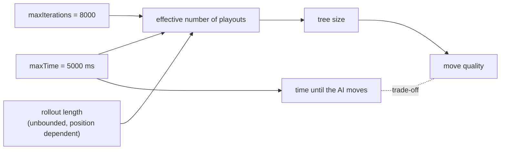

# UCT / MCTS Engine — Alquerque

This document describes the AI engine of the Alquerque project as it is
**actually implemented** in:

* [html5/src/js/engine/uct.js](../html5/src/js/engine/uct.js) — search loop, tree nodes, UCB1, backpropagation
* [html5/src/js/engine/random.js](../html5/src/js/engine/random.js) — alternative baseline provider
* [html5/src/js/worker/controller.js](../html5/src/js/worker/controller.js) — search budgets and invocation
* [html5/src/js/core/board.js](../html5/src/js/core/board.js) — the game model the search operates on

For the surrounding system structure, the Web Worker boundary, the message
protocol and the HMI, see [software_architecture.md](software_architecture.md),
in particular section 5.4 (UCT activity diagram), section 6.5 (AI move sequence)
and section 9.1 (threading). For the game rules the search obeys, see
[rules.md](rules.md).

> **Review note.** An earlier revision of this document described parameters
> (`maxDepthSimulation`, `maxLookAhead`), a difficulty/device-profile UI, side
> names "Red/South" and "White/North", and a test suite `tests/unit/uct.test.js`.
> None of these exist in this repository. The content below is corrected against
> the source; the unimplemented ideas are kept, clearly marked, in section 9.

---

## 1. Engine entry point

```js
export const getActionInfo = (state, {
  maxIterations, maxTime, rules,
  random = Math.random, now = Date.now, blockSize = BLOCK_SIZE
}) => ({ action, info })
```

Input contract — `state` is a plain board state value; the search calls the pure
functions of [board.js](../html5/src/js/core/board.js):

| Function | Used for |
| --- | --- |
| `getActions(state, rules)` | legal actions of a state (captures are compulsory) |
| `applyAction(state, action)` | the successor state; may keep the turn during a multi-jump |
| `getResult(state)` | terminal scoring, `[1, 0]` or `[0, 1]` |
| `state.active` | index of the player to move, stored in every node |

Because the model is immutable, no board copy is needed any more: a playout just
walks from one state value to the next.

Return value:

```js
{ action: Action | null,   // mostVisitedChild(root).action
  info:   'N nodes/sec examined.' }
```

Behaviour and preconditions:

* A terminal position yields `action: null`; the controller then only redraws.
* A single legal action is **not** short-circuited; the full budget is still
  spent.
* `random` and `now` are injected, which makes the search reproducible under
  test; the defaults are `Math.random` and `Date.now`.
* The returned `action` is taken from the model's own action list, so the
  controller can apply it directly with `applyAction()`.

Invocation in [controller.js](../html5/src/js/worker/controller.js):

```js
const actionInfo = search(state, {
  maxIterations: MAX_ITERATIONS, maxTime: MAX_TIME, rules
});
```

with `MAX_ITERATIONS = 8000` and `MAX_TIME = 5000`, i.e. **light and dark use
the same budget**. `search` is a constructor parameter of `createController`,
which is how the tests substitute a deterministic engine.

---

## 2. The four UCT phases in this codebase



Data flow of one playout:



### 2.1 Selection

`selectChild()` is entered only while the node is **fully expanded**
(`unexamined.length === 0`) and has children. There is no depth limit; selection
descends as deep as the tree currently reaches. It returns `null` for a node
without children.

### 2.2 Expansion

Exactly **one** node is added per playout. The action is drawn uniformly at
random from `unexamined` and removed from it by `addChild()` via `splice()`.

### 2.3 Simulation

The rollout is uniformly random and runs to a **true terminal position** — there
is no rollout depth cap and no heuristic bias. `nodesVisted` counts only these
rollout steps and feeds the `nodes/sec` diagnostic string.

> Risk: rollout length is unbounded. Positions without available captures can
> cycle; the only cycle brake in the model is the per-piece "no taking back the
> last step" rule (`Piece.previous`), which is disabled when the option
> *Inverting each pieces' own last move is… allowed* is selected. With that
> option enabled a random rollout can in principle run very long.

### 2.4 Backpropagation

```js
export const update = (node, result) => {
  node.visits += 1;
  node.wins += result[node.activePlayer];
};
```

`activePlayer` is the player **to move at that node**, captured at construction
time. `getResult()` marks the side to move at the terminal position — the side
with *no* legal action, i.e. the **loser** — with `1`.

Consequently `wins/visits` of a child expresses "how often the player to move at
the child loses", which is precisely the quantity the **parent's** mover wants to
maximise. Across alternating turns this is coherent without any sign flip.

> **Known defect.** During a compulsory multi-jump the mover does *not* change
> (`applyAction()` only switches the player when no further jump exists), so a
> child can carry the *same* `activePlayer` as its parent. For those edges
> `selectChild()` maximises the value from the opponent's perspective. This
> degrades play inside capture chains; it never produces an illegal move. A fix
> would store the *mover* of the incoming edge instead of the node's own side to
> move. Cross-reference: [software_architecture.md](software_architecture.md)
> section 5.4 and the known-gaps table in section 9.4.

---

## 3. UCB formula

`selectChild()` evaluates for every child:

$$
UCB1 = \frac{w_i}{n_i} + \sqrt{\frac{2\ln N}{n_i}}
$$

with $w_i$ = `child.wins`, $n_i$ = `child.visits` and $N$ = `this.visits`
(the parent's visit count).

Notes:

* The exploration constant is hard-coded as $\sqrt{2}$, embedded in the literal
  `2` under the square root. It is not configurable at runtime.
* Children are always visited at least once before selection can reach them
  (expansion precedes selection), so no division by zero occurs.
* Ties are resolved by iteration order: the *first* child with the strictly
  greatest value wins.

The final move choice is **most-visited**, not best-value: `mostVisitedChild()`
returns the child with the highest `visits`, the first one on ties, and `null`
for a root without children.

---

## 4. Parameters

Two parameters influence the search, plus three injection points that exist for
testability (`random`, `now`, `blockSize`).

### `maxIterations` (currently `8000`)

Upper bound on the number of playouts. It is a ceiling, not a promise: the loop
counter advances in steps of `blockSize` (50 by default), so the effective
number of playouts is the smaller of `maxIterations` rounded up to a multiple of
the block size, and whatever fits into `maxTime`.

### `maxTime` (currently `5000` ms)

Wall-clock budget. The condition `now() < timeLimit` is checked **only between
blocks**, therefore:

* on slow devices the search can overshoot `maxTime` by up to the duration of one
  block;
* `maxTime` is the binding limit in practice on mobile hardware, while
  `maxIterations` binds on fast desktops.

### Interaction



Because the engine runs in the Web Worker (see
[software_architecture.md](software_architecture.md) section 9.1), `maxTime` only
delays the move animation. The UI thread stays responsive throughout: the sidebar
menu and the full-screen Rules, Options and About subpages remain fully usable
while the AI is thinking.

---

## 5. Alternative provider: `random`

```js
export const getActionInfo = (state, { rules, random = Math.random }) => ({ action, info })
```

Picks one uniformly random legal action and reports
`'Random select out of N available actions.'`, or `null` for a terminal
position. It shares the `getActionInfo` shape with the UCT engine, so it is a
drop-in replacement for the `search` parameter of `createController` — but no
request selects it at runtime. It is useful as a strength baseline and is
covered by [tests/unit/random.test.js](../tests/unit/random.test.js).

---

## 6. Difficulty settings

**Not implemented.** There is no difficulty selector, no device-profile detection
and no per-side budget table in this repository. The Options subpage
([index.html](../html5/src/index.html), `#options-menu`) offers only:

* light / dark checkers played by Human or AI,
* inverting each pieces' own last move allowed or strictly forbidden,
* available move targets shown or hidden,
* algebraic board notation shown or hidden.

Of these, only the player types and the invert-last flag reach the worker; see
[software_architecture.md](software_architecture.md) sections 6.1 and 8.4. The
single hard-coded budget pair `(8000, 5000)` in `Controller` is the only strength
control, and changing it requires a source edit.

---

## 7. Sides and colours

The model uses `WHITE = 0` (light checkers, home row 1, moves first) and
`BLACK = 1` (dark checkers, home row 5), matching the terminology of
[rules.md](rules.md). There is no "Red", no "South" and no "North" in this
project.

---

## 8. Validation status

The engine and the model are covered by
[tests/unit](../tests/unit), run with `npm run coverage` (Vitest, v8 provider,
96 % threshold on statements, branches, functions and lines):

| Case | Test |
| --- | --- |
| Direction tables identical to the pre-refactoring implementation | `directions.test.js`, all 25 points, both players, moves and jumps |
| Compulsory capture, multi-jump continuation, invert-last rule | `board.test.js` |
| Terminal scoring marks the side to move as loser | `board.test.js`, `uct.test.js` |
| UCB1 value, selection, expansion, backpropagation, most-visited choice | `uct.test.js` |
| Immediate compulsory capture is returned under a fixed budget | `uct.test.js` |
| Iteration and time budget both terminate the search | `uct.test.js` |
| Terminal position yields `action: null` and only a redraw | `uct.test.js`, `controller.test.js` |

Still open: a strength regression (UCT versus the random baseline over many
games) and a test that pins the backpropagation perspective inside jump chains —
that one would currently fail, see section 2.4.

---

## 9. Improvement backlog

Roughly ordered by value over effort. Items 1–4 were incorrectly documented as
existing in an earlier revision of this file; they are proposals.

1. **Fix the backpropagation perspective inside multi-jumps** (see 2.4) — the
   only item that affects correctness of the search itself.
2. **Rollout depth cap** (`maxDepthSimulation`) plus a draw/abort score, to bound
   the worst-case rollout length.
3. **Look-ahead cap** for the total per-iteration path length, as a guard against
   very long single iterations.
4. **Difficulty presets and device-profile detection**, wired through a new
   Options group and carried on the existing `actionbyai` message alongside
   `playerwhite` / `playerblack` / `invertlast`.
5. **Configurable exploration constant** instead of the hard-coded $\sqrt{2}$.
6. **Time check inside the block** (or an adaptive `blockSize`) to remove the
   overshoot described in section 4.
7. **Display `actionInfo.info`** — the nodes/sec figure is computed and sent to
   the HMI, but never rendered.
8. **Transposition table** keyed by a board hash, and light rollout heuristics
   such as preferring captures that extend a chain.
