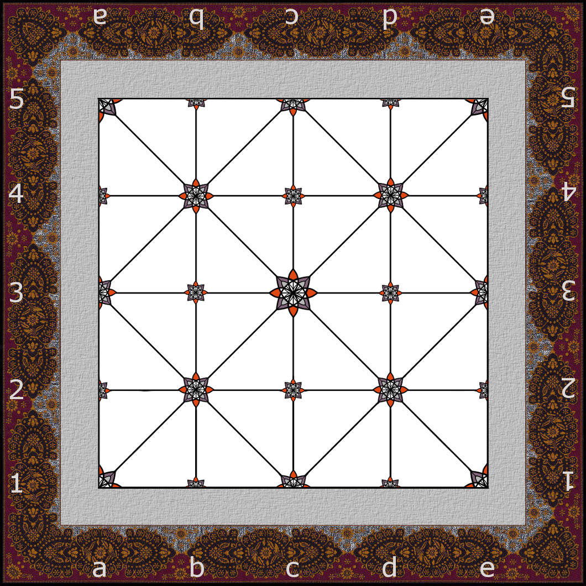
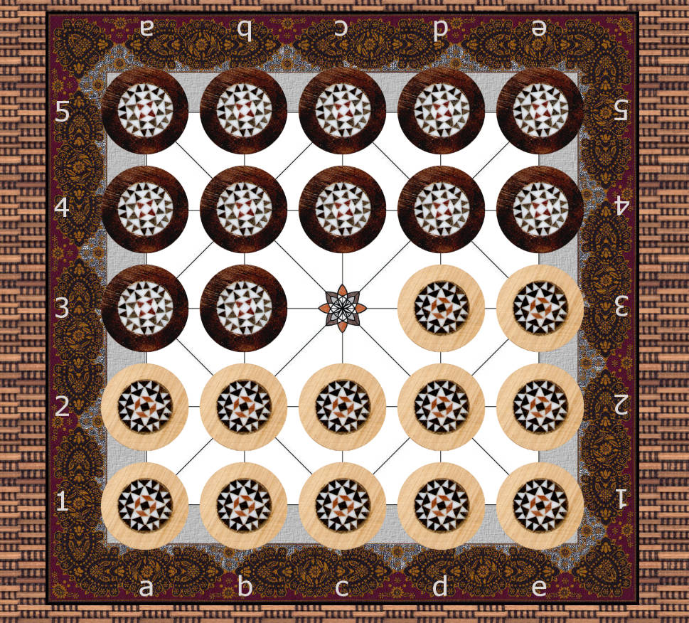

# Regeln von Alquerque

So wird Alquerque gespielt, damit sich zwei Personen an einen Tisch setzen und
das Spiel mit einem aufgezeichneten Brett und insgesamt 24 Spielsteinen spielen
können.

## Spielmaterial



* Ein Brett mit **25 Punkten**, angeordnet als Quadrat aus 5 Spalten und
  5 Reihen. Die Punkte sind die Schnittpunkte der aufgezeichneten Linien — die
  Steine stehen **auf den Punkten**, nicht in den Feldern.
* Die Linien verbinden die Punkte folgendermaßen:
  * Jeder Punkt ist mit seinem direkten Nachbarn links, rechts, oberhalb und
    unterhalb verbunden.
  * Zusätzlich sind Diagonalen eingezeichnet, so dass an jedem zweiten Punkt
    eine Diagonale vorhanden ist. Die vier Eckpunkte und der Mittelpunkt haben
    Diagonalen, die Punkte dazwischen nicht.
* **12 helle Steine** für den einen und **12 dunkle Steine** für den anderen
  Spieler. Einfache Dame-Steine oder Kieselsteine in zwei Farben genügen völlig.

Um über Positionen zu sprechen, werden die Spalten von links nach rechts mit
`a` bis `e` und die Reihen von unten nach oben mit `1` bis `5` bezeichnet.
Reihe 1 ist die **Grundreihe** von Hell, Reihe 5 ist die **Grundreihe** von
Dunkel.

```text
 5  b-b-b-b-b        b = dunkler Stein
    |\|/|\|/|        w = heller Stein
 4  b-b-b-b-b        + = leerer Punkt
    |/|\|/|\|
 3  b-b-+-w-w
    |\|/|\|/|
 2  w-w-w-w-w
    |/|\|/|\|
 1  w-w-w-w-w
    a b c d e
```

## Aufstellung



* Hell besetzt die Reihen 1 und 2 vollständig sowie die Punkte `d3` und `e3`.
* Dunkel besetzt die Reihen 5 und 4 vollständig sowie die Punkte `a3` und `b3`.
* Der Mittelpunkt `c3` bleibt frei. Er ist zu Spielbeginn der einzige freie
  Punkt.

## Ziel des Spiels

Schlage alle gegnerischen Steine vom Brett — oder bringe deinen Gegner in eine
Stellung, in der er am Zug keinen legalen Zug mehr ausführen kann. In beiden
Fällen hast du sofort gewonnen. Mit diesen Regeln ist ein Unentschieden nicht
möglich.

## Zugregeln

Hell beginnt, danach ziehen die Spieler abwechselnd. **Du musst ziehen, wenn du
am Zug bist — Aussetzen ist nicht erlaubt.**

Wenn du am Zug bist:

1. **Kannst du schlagen, musst du schlagen.** Prüfe dies zuerst.
2. Nur wenn nirgends ein Schlag möglich ist, führst du einen normalen Zug aus.

Ein normaler Zug bedeutet: Du nimmst einen eigenen Stein und ziehst ihn
**entlang einer aufgezeichneten Linie auf den benachbarten Punkt**, der leer
sein muss. Immer nur ein Schritt. Diagonale Schritte sind nur dort möglich, wo
auch tatsächlich eine Diagonale eingezeichnet ist.

Für normale Züge (nicht aber für Schlagzüge) gelten zwei Einschränkungen:

* **Kein Rückwärtsziehen.** Hell darf niemals auf eine Reihe mit kleinerer
  Nummer ziehen, Dunkel niemals auf eine Reihe mit größerer Nummer. Seitwärts
  und vorwärts ist erlaubt.
* **Der eigene letzte Schritt darf nicht zurückgenommen werden.** Standardmäßig
  darf ein Stein nicht direkt auf den Punkt zurückziehen, von dem er mit seinem
  eigenen vorherigen normalen Zug gekommen ist. Diese Historie wird für jeden
  Stein getrennt gespeichert und verhindert einfache Remis-Schleifen durch das
  Zurücknehmen von Zügen. In den Optionen kann diese Umkehr erlaubt werden. Ist
  sie strikt verboten, wähle einen anderen Schritt oder einen anderen Stein.

Ein Stein, der die gegnerische Grundreihe erreicht hat (Hell auf Reihe 5, Dunkel
auf Reihe 1), steckt dort für normale Züge fest — er kann nicht mehr normal
gezogen werden. Schlagen darf er weiterhin, und sobald ihn ein Schlagzug von
dieser Reihe weggeführt hat, kann er auch wieder normal ziehen.

Steine werden niemals gestapelt. Auf jedem Punkt steht höchstens ein Stein.

## Schlagen

Geschlagen wird wie beim Damespiel, nämlich durch **Überspringen**:

* Dein Stein steht entlang einer aufgezeichneten Linie unmittelbar neben einem
  gegnerischen Stein, und der nächste Punkt hinter diesem gegnerischen Stein
  **auf derselben geraden Linie** ist leer.
* Dann hebst du deinen Stein über den gegnerischen Stein hinweg und setzt ihn
  auf diesen leeren Punkt. Der übersprungene Stein wird **sofort vom Brett
  genommen** und kommt nicht zurück.
* Pro Sprung wird genau ein Stein übersprungen. Eigene Steine dürfen niemals
  übersprungen werden, und es dürfen nie zwei Steine auf einmal übersprungen
  werden.
* Sprünge sind in **jeder Richtung entlang der Linien erlaubt — auch rückwärts**
  in Richtung der eigenen Grundreihe. Das Rückwärtsverbot gilt nur für normale
  Züge.

**Schlagzwang.** Ist zu Beginn deines Zuges irgendein Schlag möglich, musst du
schlagen statt einen normalen Zug auszuführen.

**Mehrfachsprünge:** Kann derselbe Stein nach einem Sprung erneut springen, so
muss er das tun, und er springt weiter, bis mit diesem Stein kein weiterer
Sprung mehr möglich ist. Das alles ist ein einziger Zug. Zwischen den Sprüngen
darf die Richtung gewechselt werden. Direkt auf demselben Weg zurückspringen
kannst du nicht, da der eben übersprungene Punkt nun leer ist.

Du **musst nicht** die längste Schlagfolge wählen. Stehen mehrere Schläge oder
mehrere Fortsetzungen zur Auswahl, darfst du frei entscheiden.

## Beispielpartie

Grundstellung, Hell ist am Zug. Der einzige freie Punkt ist `c3`.

1. **Hell `c2–c3`.** Hell zieht seinen Stein vorwärts auf den freien
   Mittelpunkt. Der Punkt `c2` ist nun leer.
2. **Dunkel muss schlagen: `c4 x c3 – c2`.** Der dunkle Stein auf `c4` steht
   entlang der senkrechten Linie unmittelbar neben dem hellen Stein auf `c3`,
   und `c2` dahinter ist leer. Der helle Stein wird entfernt, Dunkel steht nun
   tief im Lager von Hell. Stand: Hell 11, Dunkel 12.
3. **Hell muss zurückschlagen, z. B. `c1 x c2 – c3`.** Der dunkle Stein auf `c2`
   wird entfernt und Hell besetzt wieder den Mittelpunkt.
   Stand: Hell 11, Dunkel 11.

In diesem Stil geht die Partie weiter. Das Material bleibt meist eine Weile
ausgeglichen, bis einem Spieler die sicheren Züge ausgehen und er einen Stein
anbieten muss. Behalte den Schlagzwang im Kopf: Ein gut platziertes Opfer kann
einen gegnerischen Stein in eine Position locken, auf die du mit einem langen
Mehrfachschlag antwortest.
