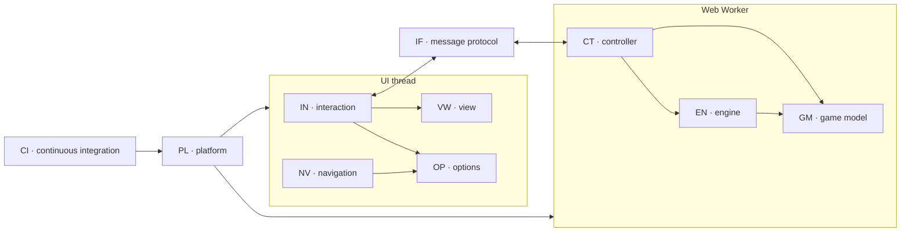

# Alquerque — Requirements

Functional (FR) and non-functional (NFR) requirements of the Alquerque HTML5
application, arranged by architectural scope and traced to the automated tests
that verify them.

Related documents:

* Game rules for players: [rules.md](rules.md) (German: [regeln.md](regeln.md))
* Structure and runtime behaviour: [software_architecture.md](software_architecture.md)
* AI engine: [engine_mcts_ucb.md](engine_mcts_ucb.md)

---

## 1. Conventions

### 1.1 Identifier scheme

`FR-<scope>-<nn>` and `NFR-<scope>-<nn>`, where `<scope>` is the architectural
scope the requirement belongs to:

| Scope | Name | Realising code |
| --- | --- | --- |
| `GM` | Game model — rules and state | [core/board.js](../html5/src/js/core/board.js), [core/directions.js](../html5/src/js/core/directions.js) |
| `EN` | Engine — computer player | [engine/uct.js](../html5/src/js/engine/uct.js), [engine/random.js](../html5/src/js/engine/random.js) |
| `CT` | Controller — authoritative game session | [worker/controller.js](../html5/src/js/worker/controller.js), [worker/entry.js](../html5/src/js/worker/entry.js) |
| `IF` | Interface — HMI ↔ worker message protocol | controller and [ui/hmi.js](../html5/src/js/ui/hmi.js) |
| `VW` | View — board rendering and animation | [ui/svgBoard.js](../html5/src/js/ui/svgBoard.js) |
| `IN` | Interaction — human input and turn dispatch | [ui/hmi.js](../html5/src/js/ui/hmi.js) |
| `NV` | Navigation — pages, sidebar, subpages | [ui/navigation.js](../html5/src/js/ui/navigation.js), [ui/controls.js](../html5/src/js/ui/controls.js) |
| `OP` | Options — user settings | [ui/options.js](../html5/src/js/ui/options.js) |
| `PL` | Platform — packaging, deployment, tooling | [index.html](../html5/src/index.html), [ui/main.js](../html5/src/js/ui/main.js), build-free static hosting |
| `CI` | Continuous integration — static analysis and quality gates | [biome.json](../biome.json), [.markdownlint-cli2.jsonc](../.markdownlint-cli2.jsonc), [vitest.config.js](../vitest.config.js), [.github/workflows/ci.yml](../.github/workflows/ci.yml) |

### 1.2 Requirement attributes

Every requirement carries:

* **Verification** — `T` automated test, `A` analysis/review, `I` inspection.
* **Trace** — the test that fails when the requirement is violated. Unit tests
  are given as `file › test name`, end to end tests as `e2e › test name`.

### 1.3 Scope map



---

## 2. Functional requirements

### 2.1 GM — Game model (rules)

The game model is the single authority for what is legal. It is implemented as
pure functions over an immutable state value.

| ID | Requirement | Verification | Trace |
| --- | --- | --- | --- |
| FR-GM-01 | The board has 25 points in a 5×5 grid; every point is connected orthogonally, and diagonals exist on every second point only. | T | `directions.test.js › knows where diagonals are drawn`, `directions.test.js › jumps at …` (25 cases) |
| FR-GM-02 | The initial position places twelve light checkers on rows 1, 2 and on d3/e3, twelve dark checkers on rows 4, 5 and on a3/b3, leaving c3 empty. | T | `board.test.js › places twelve light and twelve dark checkers with c3 free` |
| FR-GM-03 | Light moves first and players alternate; passing is not possible. | T | `board.test.js › lets light move first`, `board.test.js › switches the player after a normal move` |
| FR-GM-04 | A normal move goes one step along a drawn line onto an empty point. | T | `board.test.js › uses diagonals only where they are drawn`, `board.test.js › offers exactly the four moves into the free centre point` |
| FR-GM-05 | Light must not move to a lower row, dark must not move to a higher row. | T | `board.test.js › never moves light backwards or dark forwards` |
| FR-GM-06 | A checker on the opponent's base row can no longer perform normal moves. | T | `board.test.js › freezes a checker that reached the opponent base row` |
| FR-GM-07 | By default, a checker must not return to the point it came from with its own previous normal move; the invert option may allow it. The restriction applies per checker, prevents simple reversal draw cycles and does not apply to captures. | T | `board.test.js › forbids taking back the pieces own last step unless inverting is allowed`, `e2e › shows the rules subpage full screen and hides the board` |
| FR-GM-08 | The restriction of FR-GM-07 is tracked per checker, not per player. | T | `board.test.js › keeps the restriction bound to a single piece` |
| FR-GM-09 | Captures are compulsory: when any jump exists, no normal move is offered. | T | `board.test.js › makes captures compulsory` |
| FR-GM-10 | A capture jumps one adjacent opponent checker in a straight line onto the empty point behind it, in any direction including backwards. | T | `board.test.js › captures in every direction, backwards included` |
| FR-GM-11 | Own checkers are never jumped and never more than one checker at a time. | T | `board.test.js › never jumps own checkers or two checkers at once` |
| FR-GM-12 | The captured checker leaves the board immediately. | T | `board.test.js › removes the captured checker at once` |
| FR-GM-13 | A multiple capture is compulsory, continues with the same checker and keeps the turn until no further jump is possible. | T | `board.test.js › continues a multiple capture with the same checker and keeps the turn`, `e2e › plays a human move and forces the compulsory capture in return` |
| FR-GM-14 | An immediate jump back over the point just vacated is impossible. | T | `board.test.js › cannot jump back over the emptied point` |
| FR-GM-15 | The longest capture sequence is not enforced; all continuations stay selectable. | T | `board.test.js › continues a multiple capture with the same checker and keeps the turn` |
| FR-GM-16 | A jumping checker loses its FR-GM-07 restriction. | T | `board.test.js › clears the invert restriction of a jumping checker` |
| FR-GM-17 | Checkers are never stacked; a target point is always empty. | T | `board.test.js › removes the captured checker at once`, `svgBoard.test.js › draws both board images and twenty five points` |
| FR-GM-18 | The player to move loses when no legal action exists; the result marks that player as the loser. | T | `board.test.js › detects a finished game when no action is left`, `board.test.js › scores the side to move as the loser` |
| FR-GM-19 | Applying an action yields a new state; the previous state stays unchanged. | T | `board.test.js › switches the player after a normal move`, `uct.test.js › descends through fully expanded nodes` |
| FR-GM-20 | The rule set is identical to the pre-refactoring implementation for every point and both players. | T | `directions.test.js › direction tables match the legacy implementation` (75 cases) |

### 2.2 EN — Engine (computer player)

| ID | Requirement | Verification | Trace |
| --- | --- | --- | --- |
| FR-EN-01 | The AI selects a legal action by Monte-Carlo tree search with UCB applied to trees. | T | `uct.test.js › returns the compulsory capture` |
| FR-EN-02 | Selection maximises the UCB1 value `w/n + sqrt(2 ln N / n)`. | T | `uct.test.js › computes the UCB1 value`, `uct.test.js › selects the child with the greatest UCB1 value and none without children` |
| FR-EN-03 | Each playout expands exactly one node and simulates uniformly at random to a terminal position. | T | `uct.test.js › expands one node and simulates to a terminal position`, `uct.test.js › counts the simulated actions of a rollout` |
| FR-EN-04 | The result is propagated from the leaf to the root, accumulated from the perspective of the player to move in each node. | T | `uct.test.js › accumulates the loss of the player to move`, `uct.test.js › backpropagates up to the root` |
| FR-EN-05 | The move played is the most visited root child. | T | `uct.test.js › reports the most visited child`, `uct.test.js › returns the compulsory capture` |
| FR-EN-06 | The search stops at the iteration budget or at the wall-clock budget, whichever comes first. | T | `uct.test.js › stops as soon as the time budget is spent`, `uct.test.js › defaults to a block size of fifty` |
| FR-EN-07 | A terminal position yields no action instead of an error. | T | `uct.test.js › returns no action for a finished game`, `random.test.js › returns no action when the game is over` |
| FR-EN-08 | The engine reports a diagnostic throughput string with the chosen action. | T | `uct.test.js › returns the compulsory capture`, `random.test.js › picks the action addressed by the random source` |
| FR-EN-09 | A uniformly random provider is available as an interchangeable baseline engine. | T | `random.test.js › picks the first action for a zero sample`, `controller.test.js › lets the engine choose and apply an action` |

### 2.3 CT — Controller (game session)

| ID | Requirement | Verification | Trace |
| --- | --- | --- | --- |
| FR-CT-01 | The controller owns the only authoritative game state and runs inside a Web Worker. | T | `entry.test.js › registers the controller on the worker scope`, `controller.test.js › answers start with a redraw of the initial position` |
| FR-CT-02 | `start` renders the current position without changing it. | T | `controller.test.js › answers start with a redraw of the initial position` |
| FR-CT-03 | `perform` applies a human action and answers with the new position. | T | `controller.test.js › applies a human action and redraws` |
| FR-CT-04 | `actionbyai` lets the engine choose, applies the action and answers with the new position. | T | `controller.test.js › lets the engine choose and apply an action` |
| FR-CT-05 | `restart` resets to the initial position and answers `restore` followed by `redraw`. | T | `controller.test.js › restores the initial position on restart`, `e2e › starts a new game from the sidebar` |
| FR-CT-06 | The snapshot sent to the HMI contains the position, the player to move, all legal actions, reversals blocked by the active rules, the previous action and whether a human moves next. | T | `controller.test.js › describes square, turn, actions and who plays next`, `controller.test.js › describes reversals forbidden by the active rule` |
| FR-CT-07 | `nextishuman` is false for an AI player and for a finished game. | T | `controller.test.js › marks the next turn as non human for the AI and for a finished game` |
| FR-CT-08 | Unknown requests and foreign message classes are ignored without side effects. | T | `controller.test.js › ignores unknown requests and foreign message classes` |
| FR-CT-09 | The invert-last rule option is applied to the model before the action is evaluated. | T | `controller.test.js › lets the engine choose and apply an action` |

### 2.4 IF — Message protocol

| ID | Requirement | Verification | Trace |
| --- | --- | --- | --- |
| FR-IF-01 | HMI → worker messages carry `class: 'request'` and one of `start`, `restart`, `perform`, `actionbyai`. | T | `options.test.js › builds an engine request carrying the options`, `hmi.test.js › asks the engine to start and carries the options` |
| FR-IF-02 | Every request carries the current player types and the invert-last flag. | T | `hmi.test.js › asks the engine for a move when the AI is on turn` |
| FR-IF-03 | Worker → HMI messages carry `eventClass: 'request'` and one of `redraw`, `restore`. | T | `controller.test.js › restores the initial position on restart` |
| FR-IF-04 | The HMI ignores messages it does not understand. | T | `hmi.test.js › ignores foreign engine messages` |
| FR-IF-05 | All payloads are structured-clone friendly plain data. | A/T | `controller.test.js` (all cases exchange plain objects), `e2e › renders the initial position on the game page` |

### 2.5 VW — Board view

| ID | Requirement | Verification | Trace |
| --- | --- | --- | --- |
| FR-VW-01 | The board is drawn as inline SVG with view box `0 0 6 6`, without any third party graphics library. | T | `svgBoard.test.js › draws both board images and twenty five points`, `e2e › renders the initial position on the game page` |
| FR-VW-02 | A model point `(x, y)` is drawn at `(x + 0.5, 4.5 − y)` with size 1 × 1. | T | `svgBoard.test.js › maps model points onto the six by six view box`, `svgBoard.test.js › positions the checkers` |
| FR-VW-03 | Each of the 25 points is either a checker image or a transparent target rectangle. | T | `svgBoard.test.js › draws both board images and twenty five points` |
| FR-VW-04 | A move is animated in two consecutive steps: 600 ms translation to an enlarged midpoint at scale 1.3, then 300 ms translation to the target while shrinking back to scale 1. | T | `svgBoard.test.js › moves through an enlarged midpoint before settling`, `e2e › animates the pawn while lifting it toward the midpoint` |
| FR-VW-05 | The captured checker is removed when the animation ends. | T | `svgBoard.test.js › removes the captured checker of a jump` |
| FR-VW-06 | The board can be reset to the initial position and synchronised with an arbitrary position. | T | `svgBoard.test.js › restores the initial position`, `svgBoard.test.js › synchronises with an arbitrary position` |
| FR-VW-07 | Target points can be made visible or invisible without moving them. | T | `svgBoard.test.js › toggles the visibility of a target point` |
| FR-VW-08 | The board image with algebraic notation can be shown or hidden. | T | `svgBoard.test.js › shows and hides the algebraic notation board`, `e2e › applies an option chosen on the options subpage` |
| FR-VW-09 | A compact, horizontally padded badge on the right of the title bar shows the active player's configured type and side: human/AI and south/light or north/dark. It has a dark background, rounded corners, a light-orange border and a small rotating spinner to the left of the symbol. | T | `hmi.test.js › shows the active player and configured player type in the title bar`, `e2e › renders the initial position on the game page`, `e2e › updates the active-player badge after a move` |
| FR-VW-10 | The last move remains highlighted in light blue after animation: its empty source has a dashed ring and its occupied target has a solid ring, both at half the selectable-source stroke width. | T | `svgBoard.test.js › marks the last move with dashed source and solid target rings`, `e2e › updates the active-player badge after a move` |

### 2.6 IN — Interaction

| ID | Requirement | Verification | Trace |
| --- | --- | --- | --- |
| FR-IN-01 | Only checkers that are the origin of a legal action are clickable, and each is surrounded by a light-green circular highlight while awaiting source selection. | T | `hmi.test.js › lets a human select a checker and play a move`, `e2e › renders the initial position on the game page`, `e2e › updates the active-player badge after a move` |
| FR-IN-02 | Selecting a checker darkens its green source ring, paints that ring in front of the other highlights, and offers exactly its legal target points. | T | `svgBoard.test.js › marks a selectable source checker`, `hmi.test.js › lets a human select a checker and play a move`, `hmi.test.js › shows the available targets when the option is set`, `e2e › updates the active-player badge after a move` |
| FR-IN-03 | Selecting another checker withdraws the previous selection. | T | `hmi.test.js › hides the targets of a previous selection` |
| FR-IN-04 | Choosing a target sends the matching action and clears all handlers, so a turn cannot be submitted twice. | T | `hmi.test.js › lets a human select a checker and play a move` |
| FR-IN-05 | A click that matches no legal action sends nothing. | T | `hmi.test.js › ignores a click on a point that is not a legal target` |
| FR-IN-06 | After a redraw the turn is dispatched: human input, AI request, or nothing when the game is over. | T | `hmi.test.js › asks the engine for a move when the AI is on turn`, `hmi.test.js › animates a reported action before continuing the turn` |
| FR-IN-07 | A human move is played end to end in a real browser. | T | `e2e › plays a human move and forces the compulsory capture in return` |
| FR-IN-08 | "New" restarts the game, drops any pending selection and closes the sidebar. | T | `hmi.test.js › restarts the game and drops the selection`, `main.test.js › starts a new game from the sidebar`, `e2e › starts a new game from the sidebar` |
| FR-IN-09 | When strict inversion prevention blocks a selected checker's previous square, that square is marked with a red X. No X is shown when inversion is allowed, a capture is compulsory or the selection ends. | T | `board.test.js › forbids taking back the pieces own last step unless inverting is allowed`, `board.test.js › makes captures compulsory`, `svgBoard.test.js › marks a forbidden reversal square with a red X`, `hmi.test.js › marks a selected checkers forbidden reversal square` |

### 2.7 NV — Navigation and shell

| ID | Requirement | Verification | Trace |
| --- | --- | --- | --- |
| FR-NV-01 | Exactly one page is visible at a time: game, rules, options or about. | T | `navigation.test.js › starts on the game page`, `navigation.test.js › hides the game board when a subpage is shown` |
| FR-NV-02 | The sidebar opens from the header icon and closes through its Back item or the dismiss layer. | T | `navigation.test.js › opens the panel through the hamburger link`, `navigation.test.js › closes the panel through the back item`, `navigation.test.js › closes the panel when the dismiss layer is clicked`, `e2e › opens and closes the sidebar menu` |
| FR-NV-03 | Opening a subpage hides the game page including the board, so the subpage is full screen. | T | `e2e › shows the rules subpage full screen and hides the board` |
| FR-NV-04 | Rules and About open with the `pop` transition, Options with `slideup`. | T | `navigation.test.js › applies the configured transition classes while animating` |
| FR-NV-05 | Leaving a subpage restores the game page with the board unchanged; no engine message is exchanged. | T | `navigation.test.js › shows the board again when leaving a subpage`, `e2e › shows the rules subpage full screen and hides the board` |
| FR-NV-06 | Each subpage offers a header icon button and a bottom button, both performing a back navigation. | T | `navigation.test.js › sends back links to the browser history`, `e2e › applies an option chosen on the options subpage` |
| FR-NV-07 | The browser/device back button returns to the game page. | T | `navigation.test.js › falls back to the game page for an unknown history entry`, `e2e › returns from the about subpage through the browser back button` |
| FR-NV-08 | A page id given in the location hash opens that page on load. | T | `navigation.test.js › opens the page named in the initial location hash` |
| FR-NV-09 | Radio buttons reflect the checked option visually. | T | `controls.test.js › marks the checked option`, `controls.test.js › moves the marker when another option is chosen` |
| FR-NV-10 | Collapsible sections on the About page expand and collapse. | T | `controls.test.js › expands and collapses a section`, `e2e › returns from the about subpage through the browser back button` |
| FR-NV-11 | The game page fills the browser viewport without horizontal or vertical scrollbars; within it, the board is scaled and centred to the available space and the icon buttons scale with it. | T | `hmi.test.js › fits the board into the free area`, `hmi.test.js › clamps the icon size`, `hmi.test.js › sizes the paper, the board margin and the icons`, `main.test.js › resizes with the window`, `e2e › renders the initial position on the game page` |

### 2.8 OP — Options

| ID | Requirement | Verification | Trace |
| --- | --- | --- | --- |
| FR-OP-01 | Light and dark can each be played by a human or by the AI. | T | `options.test.js › follows the radio buttons`, `hmi.test.js › asks the engine for a move when the AI is on turn` |
| FR-OP-02 | Inverting a checker's own last move can be allowed or strictly forbidden; forbidden is the default. | T | `options.test.js › reports the shipped defaults`, `board.test.js › forbids taking back the pieces own last step unless inverting is allowed` |
| FR-OP-03 | Available target points can be shown or hidden; hidden is the default. | T | `options.test.js › reports the shipped defaults`, `hmi.test.js › shows the available targets when the option is set` |
| FR-OP-04 | The algebraic board notation can be shown or hidden; hidden is the default. | T | `options.test.js › reports the shipped defaults`, `hmi.test.js › switches on the algebraic notation board` |
| FR-OP-05 | Options are read at the moment they are needed, so a change takes effect on the next move or new game. | T | `hmi.test.js › shows the available targets when the option is set`, `e2e › applies an option chosen on the options subpage` |
| FR-OP-06 | Purely visual options never reach the game model. | A/T | `controller.test.js › lets the engine choose and apply an action` (only `invertLast` is forwarded) |

### 2.9 PL — Platform

| ID | Requirement | Verification | Trace |
| --- | --- | --- | --- |
| FR-PL-01 | The application starts from `index.html` without any build step. | T | `e2e › renders the initial position on the game page` |
| FR-PL-02 | Bootstrapping wires view, worker, navigation and form controls, and requests the first render. | T | `main.test.js › wires view, engine, navigation and controls` |
| FR-PL-03 | The engine runs in a module worker created once per session. | T | `main.test.js › creates a module worker by default` |
| FR-PL-04 | Engine messages reach the view. | T | `main.test.js › redraws through the engine listener` |
| FR-PL-05 | A `noscript` fallback explains that JavaScript is required. | I | [index.html](../html5/src/index.html) |

---

## 3. Non-functional requirements

### 3.1 Performance and responsiveness

| ID | Requirement | Verification | Trace |
| --- | --- | --- | --- |
| NFR-EN-01 | An AI move takes at most 8000 playouts and about 5 s wall clock. | T | `uct.test.js › stops as soon as the time budget is spent`; budgets asserted in `controller.test.js › lets the engine choose and apply an action` |
| NFR-CT-01 | The search never blocks the UI thread; menu, subpages and resizing stay usable while the AI thinks. | A | worker boundary, [software_architecture.md](software_architecture.md) §9.1 |
| NFR-VW-01 | Both animation phases interpolate translation and scale smoothly and linearly over 600 ms + 300 ms. | T | `svgBoard.test.js › moves through an enlarged midpoint before settling`, `e2e › animates the pawn while lifting it toward the midpoint` |
| NFR-VW-02 | Rendering scales without layout arithmetic because all geometry is expressed in board units. | T | `svgBoard.test.js › maps model points onto the six by six view box` |

### 3.2 Compatibility and portability

| ID | Requirement | Verification | Trace |
| --- | --- | --- | --- |
| NFR-PL-01 | Runs on desktop and mobile browsers supporting ES modules, module workers and inline SVG. | T | `e2e` suite (Chromium); `playwright.config.js` project list |
| NFR-PL-02 | Deployable as plain static files; no server-side logic, no network access at runtime. | I | [tools/serve.js](../tools/serve.js) serves `html5/src` unmodified |
| NFR-PL-03 | Works offline once loaded; the rules text is inlined into the application. | I | [index.html](../html5/src/index.html) rules page |
| NFR-PL-04 | No persistent storage; no user data leaves the device. | A | no storage or network API is used outside asset loading |

### 3.3 Look and feel

| ID | Requirement | Verification | Trace |
| --- | --- | --- | --- |
| NFR-VW-03 | The visual design of the previous jQuery Mobile based release is preserved exactly (dark swatch, bars, listview, buttons, icon discs, radio groups, transitions). | I | [css/theme.css](../html5/src/css/theme.css) values taken verbatim from jQuery Mobile 1.4.5 |
| NFR-VW-04 | Board, background and icon buttons keep their previous proportions and scaling behaviour. | T | `hmi.test.js › sizes the paper, the board margin and the icons` |

### 3.4 Maintainability

| ID | Requirement | Verification | Trace |
| --- | --- | --- | --- |
| NFR-GM-01 | Rules and engine are pure functions over immutable values; no shared mutable state. | A | [core/board.js](../html5/src/js/core/board.js), [engine/uct.js](../html5/src/js/engine/uct.js) |
| NFR-GM-02 | The model has no knowledge of the view; the controller has no DOM access. | A | worker boundary makes the violation impossible |
| NFR-PL-05 | Source is written as ES modules with no third party runtime dependency. | I | [index.html](../html5/src/index.html), `package.json` has `devDependencies` only |
| NFR-PL-06 | Direction tables are derived from geometry rather than hand-maintained. | T | `directions.test.js › light moves at …`, `… dark moves at …`, `… jumps at …` |

### 3.5 Testability and quality gates

| ID | Requirement | Verification | Trace |
| --- | --- | --- | --- |
| NFR-QA-01 | Statement, branch, function and line coverage of `html5/src/js/**` is at least 96 %. | T | `npm run coverage`, thresholds in [vitest.config.js](../vitest.config.js) |
| NFR-QA-02 | Time, randomness and completion scheduling are injectable so unit tests do not depend on real timers; browser animation interpolation is verified end to end. | A/T | `uct.test.js` (`random`, `now`), `svgBoard.test.js` and `navigation.test.js` (`schedule`), `e2e › animates the pawn while lifting it toward the midpoint` |
| NFR-QA-03 | The whole application is exercised in a real browser. | T | `e2e` suite, [playwright.config.js](../playwright.config.js) |
| NFR-QA-04 | Rule equivalence with the previous implementation is pinned by tests. | T | `directions.test.js › direction tables match the legacy implementation` |

### 3.6 Continuous integration and static analysis

| ID | Requirement | Verification | Trace |
| --- | --- | --- | --- |
| NFR-CI-01 | The whole workspace passes linting and static code analysis without findings. Sources (JavaScript, CSS, HTML, JSON) are checked with Biome, documentation with markdownlint. | T | `npm run lint` = `biome check --error-on-warnings` + `markdownlint-cli2` |
| NFR-CI-02 | Warnings are treated as errors; findings are fixed in the source, never suppressed. No `biome-ignore`, no `markdownlint-disable` and no rule disabled to hide an existing violation. | T/I | `--error-on-warnings` in `lint:code`; no suppression comment exists in the workspace |
| NFR-CI-03 | Formatting is deterministic and enforced, so that a check on unformatted sources fails. | T | `biome check` includes the formatter; `npm run lint:code:fix` applies it |
| NFR-CI-04 | Lint, unit tests with coverage and end to end tests run as one pipeline, locally and on the build server. | T | `npm run ci`, [.github/workflows/ci.yml](../.github/workflows/ci.yml) |
| NFR-CI-05 | The linter configuration is versioned with the sources and pinned to an exact tool version. | I | [biome.json](../biome.json), [.markdownlint-cli2.jsonc](../.markdownlint-cli2.jsonc), exact `@biomejs/biome` version in `package.json` |

### 3.7 Legal

| ID | Requirement | Verification | Trace |
| --- | --- | --- | --- |
| NFR-PL-07 | All own source is MIT licensed, graphics under CC BY-NC-SA 4.0, and the licences are reachable from the About page. | I | [LICENSE](../LICENSE), About page of [index.html](../html5/src/index.html) |
| NFR-PL-08 | Third party licence attributions remain available even though no third party code is shipped. | I | About page, [README.md](../README.md) |

---

## 4. Traceability summary

### 4.1 Test suites

| Suite | File | Requirements covered |
| --- | --- | --- |
| Geometry and rule tables | [tests/unit/directions.test.js](../tests/unit/directions.test.js) | FR-GM-01, FR-GM-20, NFR-PL-06 |
| Rules and state | [tests/unit/board.test.js](../tests/unit/board.test.js) | FR-GM-02 … FR-GM-19, FR-OP-02 |
| UCT engine | [tests/unit/uct.test.js](../tests/unit/uct.test.js) | FR-EN-01 … FR-EN-08, NFR-EN-01, NFR-QA-02 |
| Random engine | [tests/unit/random.test.js](../tests/unit/random.test.js) | FR-EN-07, FR-EN-08, FR-EN-09 |
| Controller | [tests/unit/controller.test.js](../tests/unit/controller.test.js) | FR-CT-01 … FR-CT-09, FR-IF-03, FR-IF-05, FR-OP-06 |
| Worker entry | [tests/unit/entry.test.js](../tests/unit/entry.test.js) | FR-CT-01 |
| Options | [tests/unit/options.test.js](../tests/unit/options.test.js) | FR-IF-01, FR-OP-01 … FR-OP-04 |
| Board view | [tests/unit/svgBoard.test.js](../tests/unit/svgBoard.test.js) | FR-VW-01 … FR-VW-08, FR-VW-10, NFR-VW-01, NFR-VW-02 |
| Interaction | [tests/unit/hmi.test.js](../tests/unit/hmi.test.js) | FR-IN-01 … FR-IN-06, FR-IN-08, FR-IF-01, FR-IF-02, FR-IF-04, FR-VW-09, FR-VW-10, FR-NV-11, FR-OP-03, FR-OP-05, NFR-VW-04 |
| Navigation | [tests/unit/navigation.test.js](../tests/unit/navigation.test.js) | FR-NV-01 … FR-NV-08 |
| Form controls | [tests/unit/controls.test.js](../tests/unit/controls.test.js) | FR-NV-09, FR-NV-10 |
| Bootstrap | [tests/unit/main.test.js](../tests/unit/main.test.js) | FR-PL-02 … FR-PL-04, FR-IN-08, FR-NV-11 |
| End to end | [tests/e2e/app.spec.js](../tests/e2e/app.spec.js) | FR-PL-01, FR-VW-01, FR-VW-04, FR-VW-08 … FR-VW-10, FR-IN-07, FR-IN-08, FR-GM-13, FR-NV-02, FR-NV-03, FR-NV-05 … FR-NV-07, FR-NV-10, FR-OP-05, NFR-VW-01, NFR-PL-01, NFR-QA-02, NFR-QA-03 |
| Static analysis | `npm run lint` (Biome, markdownlint) | NFR-CI-01 … NFR-CI-03 |
| Pipeline | `npm run ci`, [.github/workflows/ci.yml](../.github/workflows/ci.yml) | NFR-CI-04 |

### 4.2 Verification method distribution

| Method | Count | Requirements |
| --- | --- | --- |
| `T` automated test | 97 | all FR except FR-PL-05; NFR-EN-01, NFR-VW-01, NFR-VW-02, NFR-VW-04, NFR-PL-01, NFR-PL-06, NFR-QA-01 … NFR-QA-04, NFR-CI-01 … NFR-CI-04 |
| `A` analysis / review | 7 | FR-IF-05, FR-OP-06, NFR-CT-01, NFR-PL-04, NFR-GM-01, NFR-GM-02, NFR-QA-02 |
| `I` inspection | 9 | FR-PL-05, NFR-PL-02, NFR-PL-03, NFR-PL-05, NFR-VW-03, NFR-PL-07, NFR-PL-08, NFR-CI-02, NFR-CI-05 |

### 4.3 Measuring requirement coverage

```sh
npm run lint      # Biome and markdownlint over the whole workspace
npm test          # 195 unit tests
npm run coverage  # unit tests plus the 96 % coverage gate
npm run test:e2e  # 9 end to end tests in Chromium
npm run ci        # all of the above, the same order as the build server
```

A requirement counts as **covered** when at least one test named in its *Trace*
column exists and passes. Because trace entries use the literal test titles, the
matrix can be checked mechanically against the reporter output, for example with
`npx vitest run --reporter=json` and `npx playwright test --reporter=json`.

Current status: every `T` requirement has at least one passing test; both
linters report zero findings with warnings treated as errors; code coverage of
`html5/src/js/**` is 99.8 % statements, 98.7 % branches, 98.5 % functions and
99.8 % lines.

---

## 5. Known deviations and open points

| ID | Requirement affected | Deviation |
| --- | --- | --- |
| D-01 | FR-EN-04 | Inside a compulsory multi-jump the mover does not change, so a child node can carry the same player as its parent and UCB1 then optimises from the opponent's perspective. Playing strength only; see [engine_mcts_ucb.md](engine_mcts_ucb.md) §2.4. |
| D-02 | FR-EN-08 | The throughput string is transported to the HMI but never rendered. |
| D-03 | FR-GM-18 | The end of a game is only visible by the board becoming inert; there is no message. |
| D-04 | FR-EN-09 | The random provider is implemented and tested but no request selects it at runtime. |
| D-05 | NFR-EN-01 | The time budget is checked between blocks of 50 playouts, so it can be overshot by one block on slow devices. |
| D-06 | NFR-PL-01 | Only Chromium is configured in [playwright.config.js](../playwright.config.js); Firefox and WebKit projects are not enabled. |
