# Alquerque — Software Architecture

Architecture documentation of the HTML5 implementation found in
[html5/src](../html5/src). The functional requirements are the game rules
described in [doc/rules.md](rules.md) (German: [doc/regeln.md](regeln.md)).
The AI engine is documented separately in
[doc/engine_mcts_ucb.md](engine_mcts_ucb.md); this document covers it only at
the level of its integration into the system.

All diagrams are UML-style Mermaid diagrams and can be rendered directly on
GitHub or in VS Code.

## Document map

| Document | Scope |
| --- | --- |
| [rules.md](rules.md) / [regeln.md](regeln.md) | game rules for human players, board-only |
| [requirements.md](requirements.md) | functional and non-functional requirements with test traceability |
| this document | structure, threading, message protocol, HMI and navigation |
| [engine_mcts_ucb.md](engine_mcts_ucb.md) | UCT/MCTS search: phases, UCB1 formula, budgets, known defects, backlog |

---

## 1. Overview

| Property | Value |
| --- | --- |
| Type | Single-page (multi-"page") client-side web application |
| Languages | HTML5, CSS3, ECMAScript modules (no build step, no transpiler) |
| UI framework | none — plain DOM, own page/panel navigation |
| Board rendering | inline SVG built with `createElementNS`; no graphics library |
| Concurrency | W3C Web Worker (one dedicated module worker) |
| Game AI | Monte-Carlo Tree Search with UCB applied to trees (UCT) |
| Persistence | none — the game state lives only in the worker |
| Server needs | static file hosting only |
| Tests | Vitest (unit, jsdom) and Playwright (end to end) |

The application follows a **Model–View–Controller** split that is physically
enforced by the Web Worker boundary:

* **View / HMI** — the modules under
  [html5/src/js/ui](../html5/src/js/ui) plus the DOM in
  [html5/src/index.html](../html5/src/index.html). Runs on the UI thread.
* **Controller** — [html5/src/js/worker/controller.js](../html5/src/js/worker/controller.js),
  started by [html5/src/js/worker/entry.js](../html5/src/js/worker/entry.js).
  Runs *inside* the worker.
* **Model** — [html5/src/js/core/board.js](../html5/src/js/core/board.js) and
  [html5/src/js/core/directions.js](../html5/src/js/core/directions.js) (rules
  and state as pure functions), plus the two action providers
  [html5/src/js/engine/uct.js](../html5/src/js/engine/uct.js) and
  [html5/src/js/engine/random.js](../html5/src/js/engine/random.js), both
  described in detail in [engine_mcts_ucb.md](engine_mcts_ucb.md).

The model is written in a functional style: the game state is a value, every
rule is a pure function of that value, and `applyAction` returns a new state
instead of mutating one. Side effects are confined to the view modules and to
the single mutable reference the worker controller keeps.

The key architectural driver is: **the UCT search may block for up to 5 seconds
per move**, therefore the model and the search must not run on the UI thread.

---

## 2. Context and Deployment

### 2.1 System context

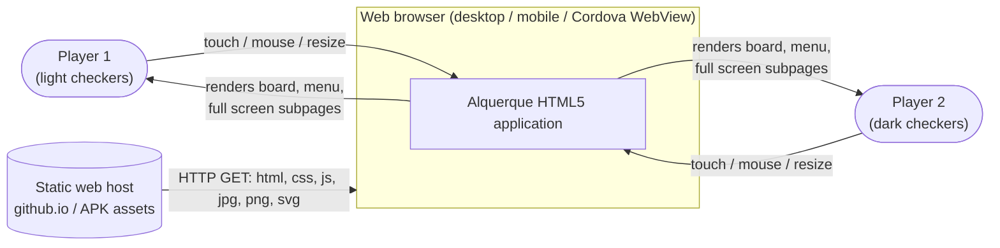

There is **no backend**. Both human players share one device ("hot seat"), or a
human plays against the built-in AI, or the AI plays against itself.

### 2.2 Deployment / artifact view

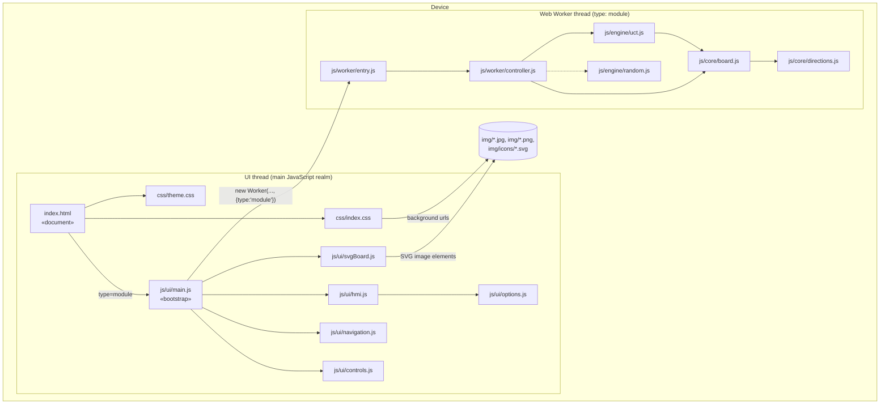

---

## 3. Component / package structure

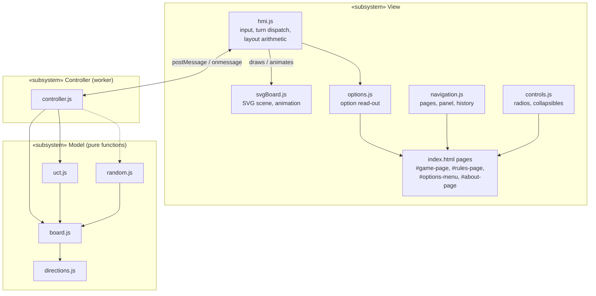

Dependency rule: the model has **no** knowledge of the view; the controller has
**no** DOM access (it cannot have — it runs in a worker). Rendering options
(`shown` / `hidden` toggles) are pure view concerns. They are included in the
request object produced by `readOptions()` but ignored by the worker; only
`invertlast`, `playerwhite` and `playerblack` affect worker behaviour.

---

## 4. Class diagram

There are no classes any more. The diagram shows the ES modules, the factory
functions they export (`\u00abfactory\u00bb`, closures holding the little state that has to
be mutable) and the pure functions (`\u00abpure\u00bb`).

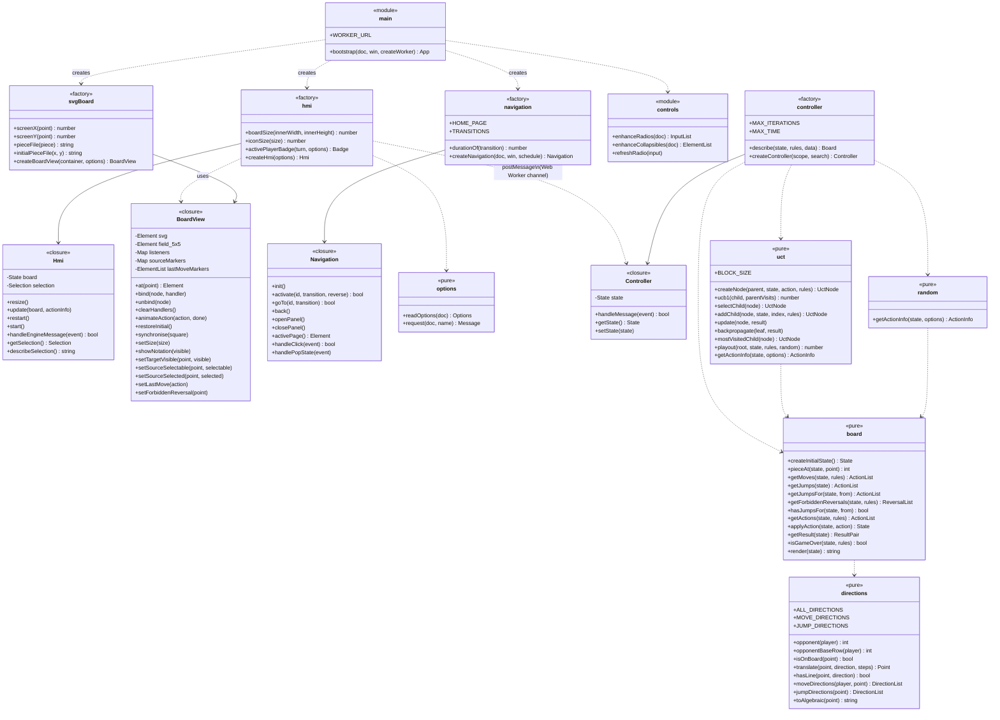

### 4.1 Model value objects

Every one of these is a plain, freely copyable value; nothing carries behaviour.

| Object | Shape | Meaning |
| --- | --- | --- |
| `Point` | `{ x: 0..4, y: 0..4 }` | `x` = column `a`..`e`, `y` = row `1`..`5` |
| `Piece` | `{ piece: WHITE\|BLACK, previous: Point\|null }` or `null` for an empty point | `previous` implements the "no taking back your last step" rule |
| `Direction` | `{ x: -1..1, y: -1..1 }` | one of the 8 line directions, frozen and shared |
| `Action` | `{ type: 'move'\|'jump', by, from, direction, to, over? }` | `over` only present for `'jump'` |
| `State` | `{ field, active, previousAction }` | the whole game position, replaced on every action |
| `Rules` | `{ invertLast: boolean }` | the only rule variant offered by the Options page |
| `Board` | `{ square, turn, actions, reversals, previous, nextishuman }` | the snapshot sent to the HMI; `reversals` contains rule-blocked `{ from, to }` pairs |
| `ActionInfo` | `{ action, info }` | chosen action plus a diagnostic string |

---

## 5. Model: rules realisation

The rule text of [doc/rules.md](rules.md) maps onto code as follows.

| Rule | Realisation |
| --- | --- |
| 5×5 points, diagonals on every second point | `hasLine()` plus the derived lookup tables `MOVE_DIRECTIONS[player][x][y]` and `JUMP_DIRECTIONS[x][y]` |
| Start position, `c3` empty | `createInitialState()` |
| Light moves first | `active: WHITE` in `createInitialState()` |
| No backward normal move | `moveDirections()` keeps `d.y >= 0` for light and `d.y <= 0` for dark |
| Piece on opponent's home row cannot move normally | `moveDirections()` returns `[]` on `opponentBaseRow(player)` |
| Jumps allowed in every direction, also backwards | `jumpDirections()` is independent of the player and keeps every on-board line |
| No taking back the piece's own last step | `Piece.previous` is checked in `getMoves()`, bypassed when `rules.invertLast` is `true`; `getForbiddenReversals()` exposes actively blocked squares for the HMI |
| Captures are compulsory | `getActions()` returns `getJumps()` and only falls back to `getMoves()` when that list is empty |
| Multiple jump is compulsory and continues with the same piece | `applyAction()` only switches the player when `hasJumpsFor(to)` is false; `getJumps()` restricts to `previousAction.to` while `previousAction.by === active` |
| No immediate jump reversal | emergent: the jumped-over point is emptied instantly, so the reverse jump has no victim |
| Longest capture not enforced | all continuations stay in the returned action list |
| Win by no legal move | `getActions().length === 0` at turn start; `getResult()` scores the side to move as the loser |

The reference tables of the previous implementation are checked into
[tests/unit/directions.test.js](../tests/unit/directions.test.js) and compared
against the derived tables for all 25 points and both players, so the
refactoring provably did not change a single legal action.

### 5.1 Action generation — activity diagram

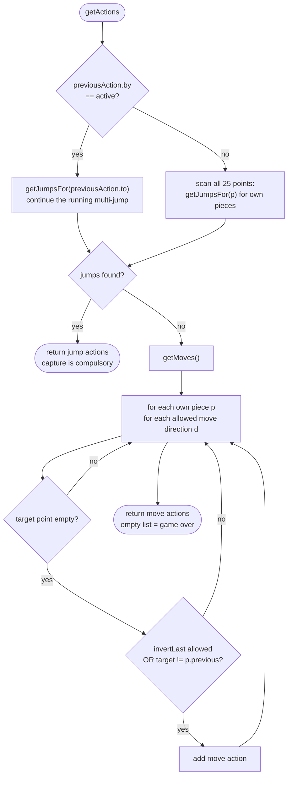

### 5.2 `applyAction` — state transition

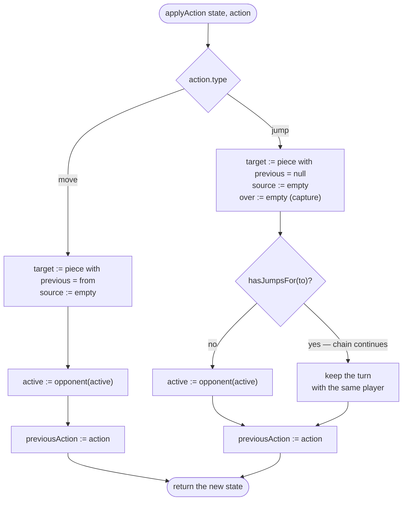

Note the deliberate asymmetry: a **move** resets `previous` to its origin (rule
"no taking back your last step"), a **jump** clears `previous` to `null`, so a
piece that has just captured is unrestricted afterwards.

### 5.3 Game state machine

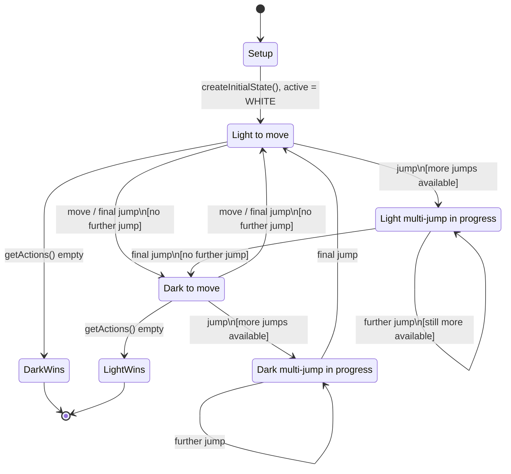

### 5.4 UCT search — activity diagram

Overview only; the authoritative engine description, including the UCB1 formula,
the budget semantics and the known defects, is
[engine_mcts_ucb.md](engine_mcts_ucb.md).

```mermaid
flowchart TD
  A([getActionInfo board,<br/>maxIterations = 8000,<br/>maxTime = 5000 ms]) --> B["root := new UctNode(null, board, null)"]
  B --> C{"iterations < 8000<br/>AND now < timeLimit?"}
  C -- no --> Z([return mostVisitedChild().action<br/>+ nodes/sec info])
  C -- yes --> D["block of 50 playouts"]
  D --> E["node := root<br/>variantBoard := board.copy()"]
  E --> F{"node fully expanded<br/>AND has children?"}
  F -- yes --> G["node := node.selectChild()<br/>UCB1: w/n + sqrt(2 ln N / n)"]
  G --> H["variantBoard.doAction(node.action)"]
  H --> F
  F -- no --> I{"unexamined actions left?"}
  I -- yes --> J["pick random unexamined action<br/>applyAction, node := addChild(...)"]
  I -- no --> K
  J --> K["Simulation:<br/>play uniformly random actions<br/>until getActions() is empty"]
  K --> L["result := getResult(variant)"]
  L --> M["Backpropagation:<br/>walk to root, update(node, result)"]
  M --> C
```

`getResult()` returns `[1, 0]` when White is to move and `[0, 1]` when Black is
to move; since the side to move at a terminal position has *no* legal action,
the entry set to `1` marks the **loser**. `update()` adds
`result[node.activePlayer]`, i.e. a node accumulates the outcome "the player to
move at this node loses" — which is exactly the value the *parent's* mover
maximises in `selectChild()`.

> Known characteristic: during a multi-jump the mover does not change, so a
> child node can carry the same `activePlayer` as its parent. In that case the
> UCB1 value is maximised from the wrong perspective. This affects the AI's
> playing strength inside capture chains only, never rule correctness. See
> [engine_mcts_ucb.md](engine_mcts_ucb.md) section 2.4.

---

## 6. Runtime: message protocol between HMI and worker

### 6.1 Interface definition

**HMI → Controller** (`engine.postMessage`), discriminated by `class` /
`request`:

| `request` | Extra payload | Effect |
| --- | --- | --- |
| `start` | options | first render of the current state |
| `restart` | options | `createInitialState()`, then `restore` + `redraw` |
| `perform` | `action` | apply a human action, then `redraw` |
| `actionbyai` | options | let the AI pick and apply an action, then `redraw` |

Options carried on **every** request: `playerwhite`, `playerblack`
(`'Human'` \| `'AI'`) and `invertlast` (`boolean`). They are read from the
Options page at send time, which implements the UI hint *"All selections will be
applied on next move or new game."* The two purely visual options
(`showavailablemove`, `showalgebraicnotation`) travel with the message as well
but are ignored by the worker.

**Controller → HMI** (`self.postMessage`), discriminated by `eventClass` /
`request`:

| `request` | Payload | Effect |
| --- | --- | --- |
| `restore` | `board` | `view.restoreInitial()` |
| `redraw` | `board`, `actioninfo` | `hmi.update(board, actionInfo)` |

> Observation: the two directions use different discriminator property names
> (`class` outbound vs. `eventClass` inbound). This asymmetry of the original
> protocol was kept on purpose so that the message contract did not change.

### 6.2 Communication diagram (object message exchange)

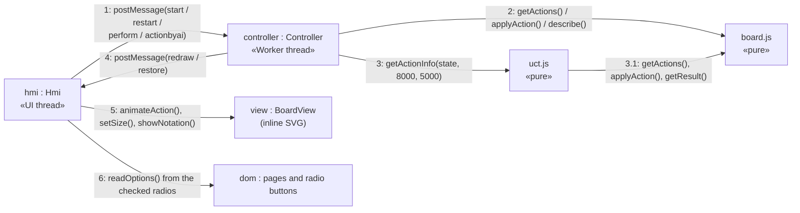

### 6.3 Sequence — application start

```mermaid
sequenceDiagram
  autonumber
  participant Browser
  participant DOM as index.html / plain DOM
  participant Hmi
  participant Paper as BoardView (inline SVG)
  participant W as Worker (Controller)
  participant Board as board.js

  Browser->>DOM: parse index.html, css/theme.css, css/index.css
  Browser->>Hmi: js/ui/main.js evaluated (type=module, deferred)
  Hmi->>Hmi: bootstrap()
  Hmi->>Paper: createBoardView(#board): svg viewBox 0 0 6 6
  Hmi->>Paper: image(algebraic_notation.jpg), image(board.jpg)
  Hmi->>Paper: 24 piece images + 1 transparent rect (initial position)
  Hmi->>Hmi: navigation.init(), enhanceRadios(), enhanceCollapsibles()
  Hmi->>Browser: addEventListener('resize', hmi.resize) ; resize()
  Hmi->>W: new Worker('js/worker/entry.js', {type:'module'})
  W->>Board: createInitialState()
  Hmi->>W: {class:'request', request:'start', options}
  W->>Board: getActions(state, rules)
  Board-->>W: action list
  W-->>Hmi: {eventClass:'request', request:'redraw', board, actioninfo:null}
  Hmi->>Hmi: update(board, null)
  alt board.nextishuman
    Hmi->>Paper: highlight and bind every legal action source
  else AI to move
    Hmi->>W: {request:'actionbyai', options}
  end
```

### 6.4 Sequence — human move (including multi-jump)

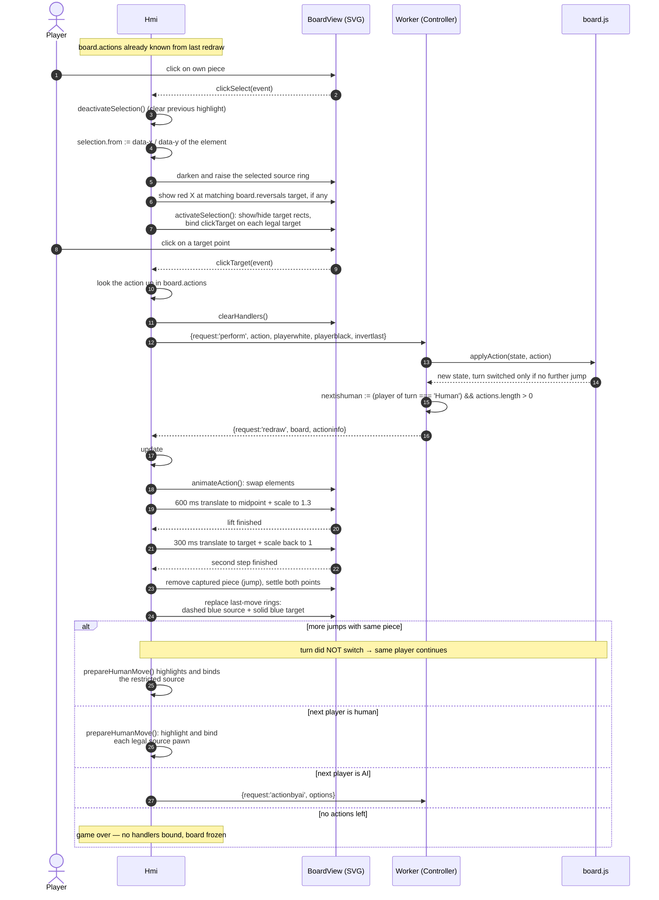

### 6.5 Sequence — AI move

```mermaid
sequenceDiagram
  autonumber
  participant Hmi
  participant W as Worker (Controller)
  participant Uct as uct.js
  participant Node as UctNode tree
  participant Board as board.js

  Hmi->>W: {request:'actionbyai', playerwhite, playerblack, invertlast}
  W->>Uct: getActionInfo(state, {maxIterations:8000, maxTime:5000, rules})
  Uct->>Node: root := createNode(null, state, null, rules)
  loop until 8000 iterations or 5000 ms (blocks of 50)
    Uct->>Node: selectChild() (UCB1) — Selection
    Uct->>Node: addChild(...) — Expansion
    Uct->>Board: random applyAction() until getActions() empty — Simulation
    Uct->>Board: getResult()
    Uct->>Node: update(result) up to the root — Backpropagation
  end
  Uct-->>W: {action: mostVisitedChild(root).action, info: 'n nodes/sec examined.'}
  W->>Board: applyAction(state, action)
  W-->>Hmi: {request:'redraw', board, actioninfo}
  Hmi->>Hmi: update() → animation → next turn dispatch
  Note over Hmi: UI thread stays responsive during the whole search;<br/>menu and subpages remain usable
```

Search internals (selection, expansion, simulation, backpropagation, budget
handling) are documented in [engine_mcts_ucb.md](engine_mcts_ucb.md).

### 6.6 Sequence — new game

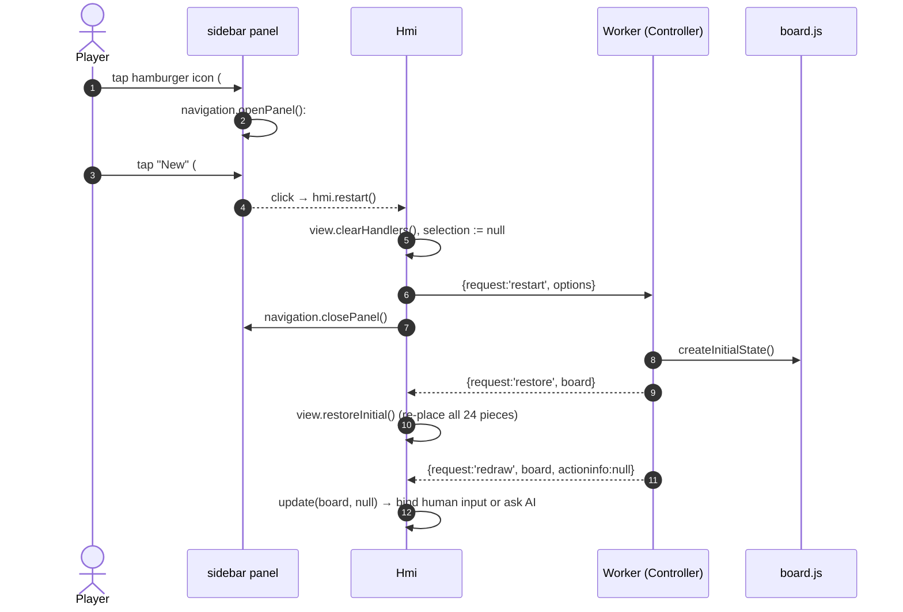

---

## 7. Use cases

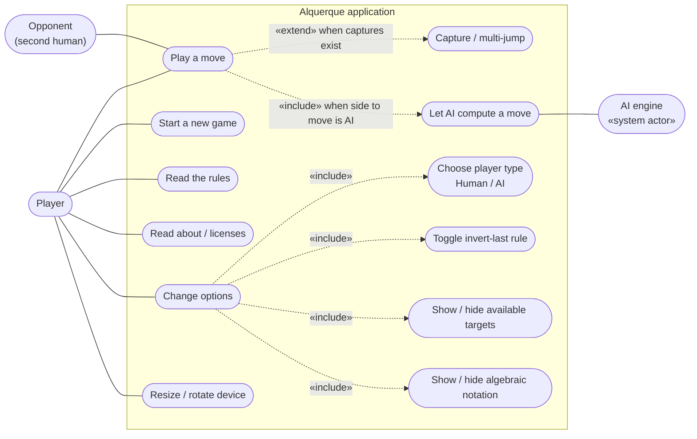

### 7.1 Use case "Play a move" (human)

| Item | Description |
| --- | --- |
| Actor | Player whose colour is configured as `Human` |
| Precondition | `board.nextishuman == true`, i.e. it is that colour's turn and at least one legal action exists |
| Trigger | Tap/click on one of the highlighted-source pieces |
| Main flow | 1. Select source → legal targets become clickable. 2. Select target → HMI matches it against `board.actions` and posts the matching action as `perform`. 3. Worker applies it and answers `redraw`. 4. HMI animates. 5. Turn passes, or the same player continues a multi-jump. |
| Alternative | Selecting a different source before a target: `deactivateSelection()` removes the old target bindings first. |
| Postcondition | Board rendered in the new state; input handlers bound for whoever moves next. |
| Exception | No action list entry matches → nothing is posted; the board keeps waiting. |

---

## 8. HMI internal structure and navigation

This is the part the user interacts with most, so it is documented in detail.

### 8.1 Composite structure of the game page

`#game-page` uses border-box sizing and a height of `100vh`, upgraded to
`100dvh` in browsers that support dynamic viewport units. The fixed-header
padding is therefore included in the viewport height. Overflow is hidden on the
game page only, removing browser scrollbars while Rules and About remain
scrollable. The textured background covers the complete visible viewport.

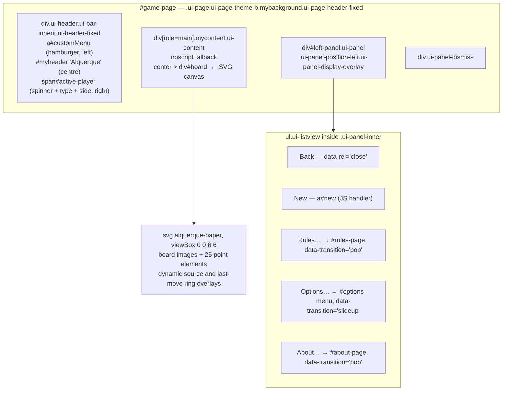

### 8.2 Sidebar menu and full-screen subpages

`index.html` contains **four** elements with class `ui-page`:
`#game-page`, `#rules-page`, `#options-menu`, `#about-page`.

[navigation.js](../html5/src/js/ui/navigation.js) shows **exactly one page at a
time**: the active page carries `ui-page-active`, every other one is
`display: none` through `.ui-page`. Therefore navigating from the sidebar to
*Rules…*, *Options…* or *About…*:

1. hides `#game-page` **including the whole `#board` SVG canvas** — the game
   board is not merely covered, it is removed from the visual flow, so the
   subpage is genuinely full screen;
2. shows the requested subpage with the configured transition
   (`pop` for Rules and About, `slideup` for Options), by adding the animation
   classes `<transition> in` to the incoming and `<transition> out` to the
   outgoing page and stripping them again after the animation;
3. pushes a history entry (`history.pushState`, hash `#<page id>`), so the
   hardware/browser Back button works.

Returning is always a **back navigation** (`data-rel='back'` →
`history.back()`), never a forward link. Each subpage offers two equivalent ways
back:

* the round icon button in the header (`#customBackRules`, `#customBackOptions`
  — labelled *Close*, `#customBackAbout`), and
* a full-width button at the very bottom of the content (*Back* / *Ok*).

The `popstate` handler activates the page named in the history entry, or
`#game-page` when there is none, and replays the transition in reverse. The
board becomes visible in exactly the state it was left in — the SVG DOM is never
torn down, and no engine message is exchanged. The worker keeps the
authoritative game state, so the game cannot be disturbed by navigating away; an
AI search that is running continues undisturbed in the worker while a subpage is
open.

The sidebar panel itself is an **overlay panel**, not a page: it slides over
`#game-page` and is closed either by the *Back* item (`data-rel='close'`), by
tapping the dismiss layer outside it, or programmatically when *New* is chosen.

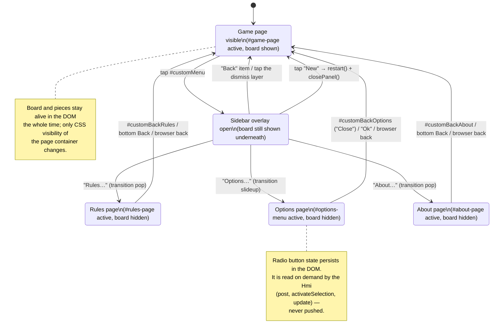

### 8.3 Navigation activity — leaving and re-entering a subpage

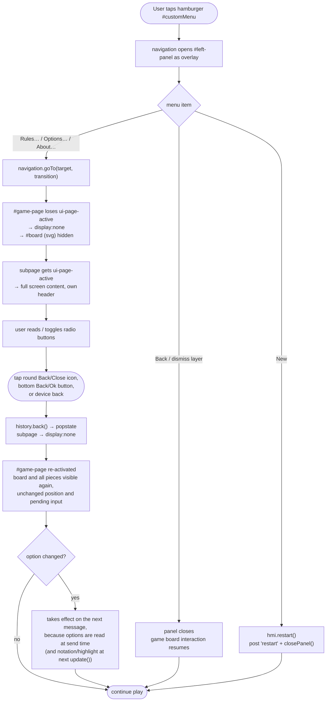

### 8.4 Where each option is consumed

| Option (DOM id) | Read in | Consumed by |
| --- | --- | --- |
| `#playerwhiteai`, `#playerblackai` | `readOptions()` on every `post()` and `update()` | `describe()` → `board.nextishuman`; `activePlayerBadge()` → title-bar symbol and label |
| `#invertAllowed` | `readOptions()` on every `post()` | `toRules()` → `rules.invertLast` |
| `#showavailablemove` | `activateSelection()` | opacity of the target rectangles (`0.4` vs. `0`) |
| `#showalgebraicnotation` | `update()` | `view.showNotation()` reorders and hides the two board images |

Consequence of this pull-based design: the two *rendering* options act on the
next repaint or selection, the two *engine* options act on the next message —
matching the hint text *"All selections will be applied on next move or new
game."* on the Options page.

On every `redraw`, `activePlayerBadge()` combines `board.turn` with the current
player-type options. The right-aligned badge displays `🧑▼` or `🤖▼` for the
light/south player and `🧑▲` or `🤖▲` for the dark/north player. Its
`aria-label` and tooltip provide the equivalent textual description. A small
CSS-animated spinner sits to the left of the symbol and is marked
`aria-hidden` because it is purely decorative. The compact status span has a
dark background, rounded light-orange border and horizontal padding.

`BoardView` owns three independent visual marker sets. `sourceMarkers` contains
the light-green rings for legal human move origins. Selecting one darkens it
and moves its circle to the end of the SVG child list, which is the SVG
equivalent of raising its z-index. `lastMoveMarkers` contains a light-blue
dashed source ring and solid target ring at half the green stroke width. The
blue pair is replaced after each completed animation and removed by `restore`.
The transient `forbiddenReversalMarker` is the red X for the selected checker.

The controller derives `board.reversals` from the same model state and
`invertLast` rule used for legal move generation. A pair is emitted only when
the previous square is empty, connected by an allowed normal-move direction
and no capture supersedes normal moves. Selecting its `from` checker calls
`setForbiddenReversal(to)`, which appends a pointer-transparent red SVG X above
the board. Changing selection, submitting a move, redraw and restart remove it.

### 8.5 Responsive layout

`hmi.resize()` is bound to `window.resize` and additionally called at the start
of every `update()`:

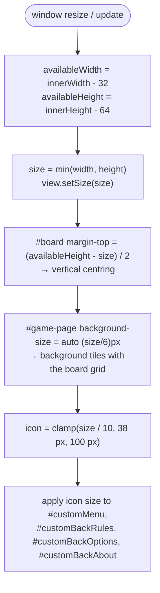

Because the SVG canvas uses `viewBox="0 0 6 6"`, all board geometry is expressed
in board units and scaling is free of layout maths: a piece at model point
`(x, y)` is drawn at `(x + 0.5, 4.5 - y)` with size `1 × 1`. The `4.5 - y` term
(`screenY()`) is the single place where the model's bottom-up row numbering is
flipped to the screen's top-down y axis.

---

## 9. Cross-cutting concerns

### 9.1 Threading and responsiveness

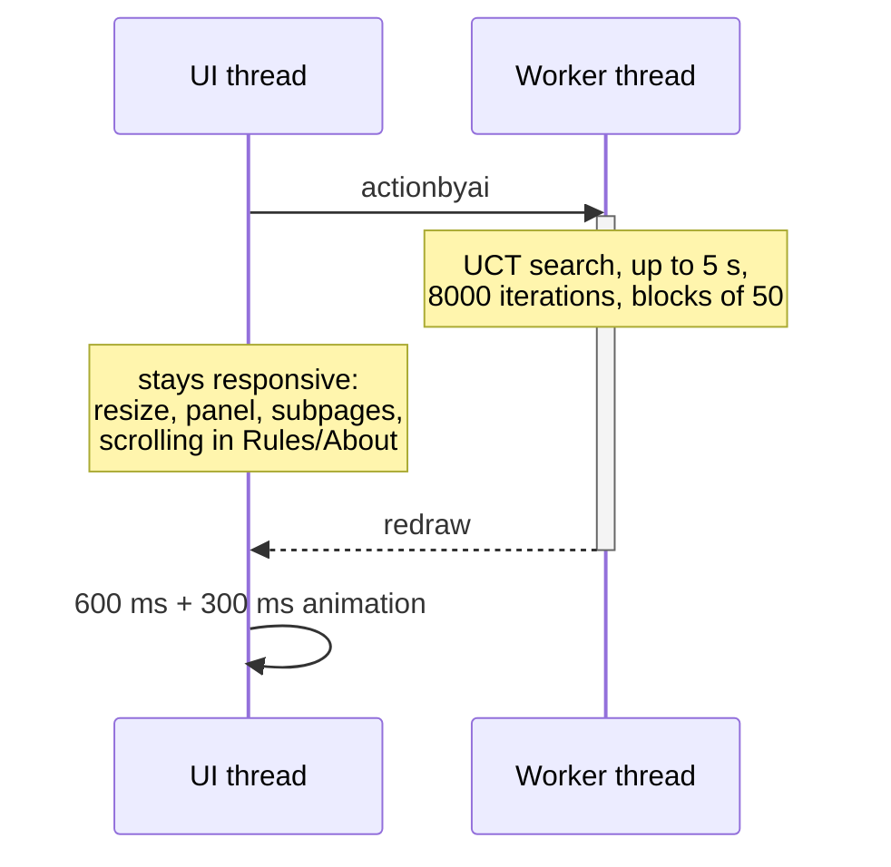

The worker is created once in `bootstrap()` and lives for the whole session; it
is never terminated or restarted, so the model reference is stable and `restart`
is a message rather than a re-creation.

### 9.2 Input safety

* Only points that appear in the last received `board.actions` list get click
  handlers and a circular light-green source highlight, so illegal input is
  structurally impossible from the UI.
* `clickTarget()` clears **all** handlers before posting, so a single turn
  cannot be submitted twice.
* The view keeps its own `Map` of bound listeners, so `unbind()` and
  `clearHandlers()` can remove exactly the handlers that were added.
* The HMI sends an action object selected from the legal actions supplied by the
  worker in the previous `redraw`. The worker owns the state but currently
  trusts this payload rather than validating it against freshly generated legal
  actions.

### 9.3 Testing

| Layer | Tool | Location |
| --- | --- | --- |
| Rules, engine, controller, UI modules | Vitest (+ jsdom for the DOM modules) | [tests/unit](../tests/unit) |
| Whole application in a real browser | Playwright (Chromium) | [tests/e2e](../tests/e2e) |

`npm run coverage` enforces 96 % statement, branch, function and line coverage
over `html5/src/js/**`. `npm run test:e2e` serves `html5/src` with
[tools/serve.js](../tools/serve.js) and drives the real UI: menu, all three
subpages including the hidden/visible board, options, a human move with the
compulsory capture in return, active-player badge and spinner, source-selection
and last-move highlights, smooth first-phase pawn animation, and a new game.

Testability shaped the design: the model is pure, `uct.getActionInfo` takes
`random` and `now`, the board view takes `schedule`, and the navigation takes
`schedule` too, so unit tests do not have to wait for timers. The browser suite
uses real time where it verifies CSS transition interpolation.

### 9.4 Known gaps

| Item | Location | Effect |
| --- | --- | --- |
| `actionInfo.info` is not displayed | `hmi.update` | the nodes/sec figure is computed but never shown |
| No end-of-game message | `hmi.update` | game over is only recognisable by the board becoming inert |
| `'response'` message class unused | both sides | reserved extension point |
| `Random` engine not wired to a request | `controller.js` | the alternative provider exists but is not selectable |
| UCB perspective inside jump chains | `uct.update` | see section 5.4 and [engine_mcts_ucb.md](engine_mcts_ucb.md) section 2.4 |
| No difficulty setting | `controller.js` | budget hard-coded to `(8000, 5000)` for both sides |
| Human action payload not revalidated | `controller.perform` | direct callers of the worker protocol are trusted to send an action from the previous `redraw` |

---

## 10. Traceability: rules ↔ architecture ↔ UI

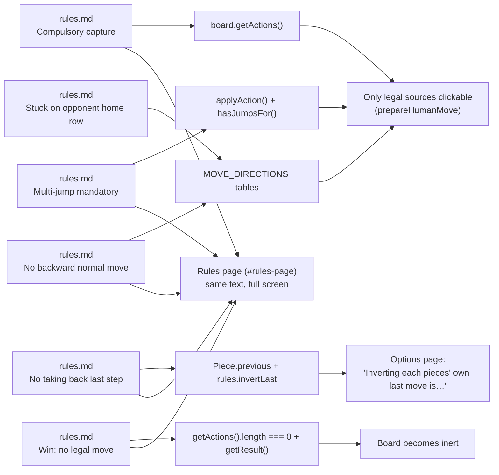

The Rules subpage duplicates the rule text of [doc/rules.md](rules.md) as inline
HTML so that the application stays fully self-contained and usable offline.
